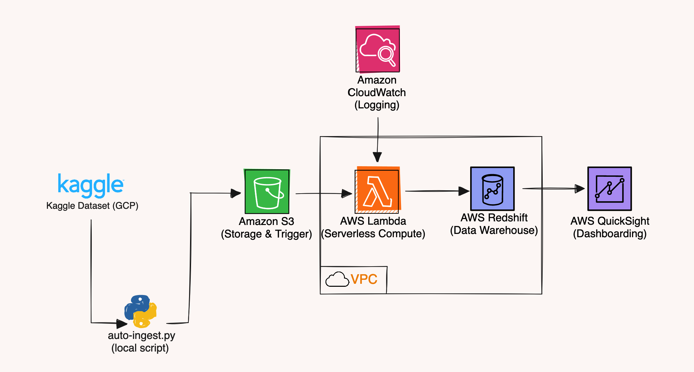

# Health Data Analytics

### Project Description: An Event Driven Approach to Health Data Warehousing 


## 1. Identify the medical datasets for which you would like to create a cloud-based data warehouse.
The Kagggle Healthcare Dataset by [Tomas Lui](https://www.kaggle.com/datasets/tomaslui/healthcare-dataset/data) relates 
to healthcare transactions and billing information. It contains details of medical transactions/services provided, including 
the date, payer, location, diagnosis code, CPT code, charges, payments, and adjustments. It aims to join several datasets that 
provide more attributes on the patients, physicians, payers, dates, transactions, locations, diagnosis codes and CPT codes 
related to that transaction. It provides descriptive details that enable analysis of the transactional data from various 
perspectives - by patient, by physician, by date, by payer, by location etc. For example the dimPatient table contains 
demographic details on each patient like name, age, gender, city, state etc. while dimPhysician contains details on the 
treating physician like name, specialty, FTE.
In summary, this is a healthcare dataset can be useful in designing a data warehouse that enables analytics on patient 
transactions and billing to analyze performance, costs, utilization etc. We can design a star schema with the fact table 
linking to the various dimension tables allows slicing and dicing the data by the various dimensions that describe each 
transaction.

## 2. Cloud-Based Design Architecture



### 2A. Define the application you want to use for the collected medical data.
- **Amazon Simple Storage Service (Amazon S3):** is an object storage service offering industry-leading scalability, 
    data availability, security, and performance. It stores and protects any amount of data for any use case. With 
    cost-effective storage classes and easy-to-use management features, you can optimize costs, organize data, and configure 
    fine-tuned access controls to meet specific business, organizational, and compliance requirements[1]. 

- **AWS Lambda:** is a serverless, event-driven compute service that lets you run code for virtually any type of application 
    or backend service without provisioning or managing servers. You can trigger Lambda from over 200 AWS services and 
    software as a service (SaaS) applications, and only pay for what you use[2]. 

- **Amazon CloudWatch:** is a service that monitors applications, responds to performance changes, optimizes resource use, 
    and provides insights into operational health. By collecting data across AWS resources, CloudWatch gives visibility 
    into system-wide performance and allows users to set alarms, automatically react to changes, and gain a unified view 
    of operational health[3].

- **Amazon QuickSight:** is a unified data-driven business intelligence (BI) at hyperscale. With QuickSight, all users 
    can meet varying analytic needs from the same source of truth through modern interactive dashboards, paginated reports, 
    embedded analytics, and natural language queries. Business analysts and business users can use natural language to 
    build, discover, and share meaningful insights in seconds, turning insights into impact faster[4].

### 2B. Choose a cloud data warehouse solution for your problem.
- **Amazon Redshift:** is a fully managed, AI powered, massively parallel processing (MPP) architecture, it 
    drives business decision-making quickly and cost effectively. AWS’s zero-ETL approach unifies all your data for 
    powerful analytics, near real-time use cases and AI/ML applications. Share and collaborate on data easily and securely 
    within and across organizations, AWS regions and even 3rd party data providers, supported with leading security 
    capabilities and fine-grained governance[5]. 

## 3. Implement the proposed medicaldata warehouse on a Hadoop system or equivalent.
### 3A. Application overview.
The application loads medical transaction data from AWS S3 bucket into AWS Redshift data warehouse to enable analytics. 
AWS Lambda functions are used to orchestrate these ETL jobs based on schedules.
### 3B. Objectives: Briefly describe each goal/objective and whether they have been completed.

- [x] Ingest raw CSV data files from Kaggle into S3 buckets — Completed
  - [x] Either by maunal download and upload of dataset into S3
  - [x] Either by auto-ingest by a local python script
- [x] Implement AWS Lambda functions to detect new data and run ETL jobs - Completed
  - [x] Develop an AWS Lambda Layer builder to package dependencies
  - [x] Configure AWS CloudWatch to log events when files are uploaded into S3
  - [x] Set up S3 uploads as event trigger for AWS Lambda ETL jobs
- [x] Transform data to match Redshift schema requirements — Completed
  - [x] Load cleansed, transformed data into Redshift
- [x] Build analytics dashboard on top of Redshift - Completed

### 3C. Describe the problem and the collection of the datasets.
The medical transaction dataset is obtained from Kaggle data repository which is hosted on Google Cloud Storage (GCP). 
The dataset contains details of medical services, charges, payments for patients which the hospital management needs in 
making valuable decisions periodically. Analytics on this storage is largely challenging and computationally intensive.

The goal is to extract this data and load it into an analytical storage (data warehouse) to periodically reporting and 
analytics. It is collected by loading the raw CSV files into an S3 bucket either by a python script or it is loaded manually.

### 3D. Explain your methodology and implementation.
- AWS Lambda functions that use CloudWatch Event triggers are created to detect new files landing in S3 and launching the ETL process.
- The Lambda processes the CSV files, cleanses the data, transforms it to match the Redshift schema
- The processed files are then loaded into Redshift using psycopg2 python library API 
- The AWS Data Pipeline is configured with various data processing stages to handle ETL orchestration
- The end-goal is to provide a rich dashboard that drives business decisions

### 3E. Discuss the suitability of the tool being used to solve the problem.
AWS Redshift provides fast SQL queries on structured data using columnar storage and advanced query optimization. 
This makes it the right data warehousing choice. AWS Lambda in combination with CloudWatch Events provides simple, 
auto-triggered orchestration. S3 holds raw files cost-effectively while QuickSight provides business intelligence (BI) at 
hyperscale. Together, they form an optimal cloud-native ETL, data warehousing and dashboarding solution.

### 3F. Describe the features of your software.
- Automated pipeline triggered on new data arrival
- Incremental loads to Redshift to minimize processing
- Lambda functions for data validation, cleansing
- Parallel data load into Redshift for fast ingestion
- Table optimizations like sort keys on Redshift tables
- QuickSight for rich visualisation

### 3G. Give a worked example.
1. Auto-Ingest Local Python Script
```text
src
├── auto-ingest.py
└── config.py
```
```python
# auto-ingest.py
import os
import boto3
import config
import zipfile

# kaggle environment variables
os.environ['KAGGLE_KEY'] = config.KAGGLE_KEY
os.environ['KAGGLE_USERNAME'] = config.KAGGLE_USERNAME
import kaggle


def main():
    kaggle.api.authenticate()
    kaggle.api.dataset_download_files(config.KAGGLE_DATASET, path='../datasets')

    with zipfile.ZipFile('../datasets/' + config.KAGGLE_DATASET.split('/')[1] + '.zip', 'r') as folder:
        folder.extractall(path='../datasets')
        os.remove('../datasets/' + config.KAGGLE_DATASET.split('/')[1] + '.zip')
        file_names = folder.namelist()

    s3 = boto3.resource(
        service_name=config.SERVICE_NAME,
        region_name=config.REGION_NAME,
        aws_access_key_id=config.AWS_ACCESS_KEY_ID,
        aws_secret_access_key=config.AWS_SECRET_ACCESS_KEY
    )
    exclude_files = ['dimDiagnosisCode.csv', 'dimCptCode.csv', 'Datadictionery.csv']
    for file_name in file_names:
        if file_name not in exclude_files:
            s3.meta.client.upload_file('../datasets/' + file_name, config.BUCKET_NAME, file_name)
            print(f'Uploaded ==== {file_name}')


if __name__ == '__main__':
    main()
```

```python
# config.py

# Kaggle Credentials
KAGGLE_USERNAME = 'KAGGLE_USERNAME'
KAGGLE_KEY = 'KAGGLE_KEY'
KAGGLE_DATASET = 'tomaslui/healthcare-dataset'

# AWS Credentials
AWS_ACCESS_KEY_ID = 'AWS_ACCESS_KEY_ID'
AWS_SECRET_ACCESS_KEY = 'AWS_SECRET_ACCESS_KEY'
BUCKET_NAME = 'healthdata-v2-bucket'
SERVICE_NAME = 's3'
REGION_NAME = 'eu-north-1'
```
2. AWS Lambda Layer Builder
```text
aws-lambda-layer-builder
├── Dockerfile
├── README.md
├── docker_install.sh
├── requirements.txt
└── runner.sh
```
```dockerfile
# Dockerfile
FROM amazonlinux:2.0.20230307.0
RUN ulimit -n 1024 && yum -y update && yum -y install \
    python37 \
    python3-pip \
    python37-devel \
    zip \
    && yum clean all
RUN python3 -m pip install pip==23.2.1
RUN pip install virtualenv==20.25.0
```
```markdown
[//]: # (README.md)
# AWS Lambda Layer Builder
1. Checker all files have your lambda function python version
2. Change the requirements to the python package you want to create lambda layer dependency
3. Start up docker on your machine
4. Give runner.sh full permission and run
$ chmod 744 runner.sh
$ ./runner.sh
```
```shell
# docker_install.sh
virtualenv --python=/usr/bin/python3.7 python
source python/bin/activate
pip install -r requirements.txt -t python/lib/python3.7/site-packages
zip -r9 python.zip python
```
```text
# requirements.txt
urllib3==1.26.18
```
```shell
# runner.sh
container_name=lambda_builder_container
docker_image=lambda_builder_image

docker build -t $docker_image .
docker run -td --name=$container_name $docker_image
docker cp ./requirements.txt $container_name:/
docker exec -i $container_name /bin/bash < ./docker_install.sh 
docker cp $container_name:/python.zip python.zip
docker stop $container_name
docker rm $container_name
```

3. AWS Lambda Function
```text
├── healthDataETL/
└── lambda_function.py
```
```python
# lambda_function.py
import os
import io
import csv
import boto3
import logging
import psycopg2
import urllib.parse


s3 = boto3.client('s3')
logger = logging.getLogger()
logger.setLevel(logging.INFO)

def lambda_handler(event, context):
    print(f'event ==== {event}')
    
    object_key = event['Records'][0]['s3']['object']['key']
    bucket_name = 'healthdata-bucket'

    # Call the function to read CSV from S3
    try:
        bucket = event['Records'][0]['s3']['bucket']['name']
        key = urllib.parse.unquote_plus(event['Records'][0]['s3']['object']['key'], encoding='utf-8')
        
        response = s3.get_object(Bucket=bucket, Key=key)
        content = response['Body'].read().decode('utf-8')
        csv_data = list(csv.reader(io.StringIO(content)))
        print(f'csv_data ==== {csv_data}')
        
        # Insert data into Redshift
        insert_data_to_redshift(csv_data, key)

    except Exception as e:
        print(f"Error reading CSV from S3: {str(e)}")
        logger.error(f"An error occurred: {str(e)}")
        

def insert_data_to_redshift(csv_data, key):
    # Redshift connection parameters
    dbname = os.environ.get('DATABASE')
    user = os.environ.get('USER_NAME')
    password = os.environ.get('PASSWORD')
    host = os.environ.get('HOST')
    port = '5439'
    
    conn_string = f"dbname='{dbname}' user='{user}' password='{password}' host='{host}' port='{port}'"
    
    try:
        conn = psycopg2.connect(conn_string)
        print("Connected to Redshift successfully!")
        
        # Get columns from the CSV data (first row)
        columns = csv_data[0]
        
        # Get table name from the key
        table_name = key.split('.csv')[0] 
        
        # Create table query based on columns in CSV
        create_table_query = f"CREATE TABLE IF NOT EXISTS {table_name} ({', '.join(f'{col} VARCHAR(255)' for col in columns)});"
        
        cursor = conn.cursor()
        cursor.execute(create_table_query)
        conn.commit()
        
        # Prepare INSERT query
        insert_query = f"INSERT INTO {table_name} VALUES ({', '.join(['%s'] * len(columns))});"
        
        # Skip the first row (header) and insert remaining rows into Redshift
        with conn.cursor() as cursor:
            for row in csv_data[1:]:
                print(f'row ==== {row}')
                print(f'insert_query ==== {insert_query}')
                cursor.execute(insert_query, row)
                conn.commit()
        
        
        cursor.close()
        conn.close()
        print("Closed Redshift connection successfully!")

    except Exception as e:
        print("Error:", e)
        logger.error(f"Error inserting data into Redshift: {str(e)}")
```

### 3H. Conclusion
Developed a cloud-based solution that features an ETL pipeline that successfully loads the medical data from S3 bucket 
into Redshift in an automated, efficient manner, readying it for analytics and business intelligence purposes. 

## 4. Build a Dashboard for your system, showing how it can be used
Some analyses the dashboard can provide on top of the warehouse are:
- Daily/Monthly billing reports
- Payments collected vs. pending by payer e.t.c
The dashboard allows slicing and dicing data on various dimensions like date, patient, physician etc. 
enabling data-driven decisions.

## 4A. How to use:
1. Upload the Kaggle dataset by either the two options (this can take up to 15mins):
    - Run the src/auto-ingest.py file in the parent folder
        ```shell
        source venv/bin/activate
        python src/auto-ingest.py
        ```
    - Or login AWS S3 console and upload the Kaggle dowloaded files manually to *healthdata-v2-bucket* 

2. The downstream processes are automatic, but you can monitor each event through CloudWatch Log Groups

3. Visit Lambda to view to ETL code (The code was also provided in this report.)

4. Visit AWS QuickSight to view the Dashborads.


## References
Citations:
- [1] Amazon S3 Object Storage https://aws.amazon.com/s3/
- [2] AWS Lambda https://aws.amazon.com/lambda/
- [3] Amazon CloudWatch https://aws.amazon.com/cloudwatch/
- [4] Amazon QuickSight https://aws.amazon.com/quicksight/
- [5] Amazon Redshift https://aws.amazon.com/redshift/


